# 🏛️ Architecture & System Design — Glow Studio by Sofia

> **Document Version:** 2.0.0  
> **Target Audience:** Principal Engineers, Tech Leads, DevOps, Solutions Architects  
> **Status:** Approved / Living Architecture  
> **Last Updated:** 2026-08-30

---

## 📑 Tabla de Contenidos
1. [Visión General del Sistema](#1-visión-general-del-sistema)
2. [Diagramas C4 (Mermaid)](#2-diagramas-c4-mermaid)
   - [Nivel 1: Contexto del Sistema (System Context)](#nivel-1-contexto-del-sistema-system-context)
   - [Nivel 2: Contenedores (Container Diagram)](#nivel-2-contenedores-container-diagram)
   - [Nivel 3: Componentes de Express API](#nivel-3-componentes-de-express-api)
   - [Nivel 3: Componentes del Bot IA (FastAPI)](#nivel-3-componentes-del-bot-ia-fastapi)
   - [Nivel 3: Componentes del Frontend (Next.js 16)](#nivel-3-componentes-del-frontend-nextjs-16)
3. [Flujos de Datos Principales](#3-flujos-de-datos-principales)
   - [3.1 Flujo de Reserva Multicanal](#31-flujo-de-reserva-multicanal)
   - [3.2 Pipeline Conversacional del Bot IA (Groq Cloud)](#32-pipeline-conversacional-del-bot-ia-groq-cloud)
   - [3.3 Persistencia de Sockets Baileys en PostgreSQL](#33-persistencia-de-sockets-baileys-en-postgresql)
   - [3.4 Sincronización Bidireccional con Google Calendar](#34-sincronización-bidireccional-con-google-calendar)
   - [3.5 Cola de Mensajería Saliente y Resiliencia Anti-Ban](#35-cola-de-mensajería-saliente-y-resiliencia-anti-ban)
4. [Capas de Seguridad y Blindaje de Red](#4-capas-de-seguridad-y-blindaje-de-red)
5. [Topología de Despliegue e Infraestructura](#5-topología-de-despliegue-e-infraestructura)

---

## 1. Visión General del Sistema

**Glow Studio by Sofia** es una plataforma tecnológica integral para la automatización, gestión y atención omnicanal de salones de belleza y estética premium.

El sistema resuelve la convergencia de tres canales principales de interacción (Página Web interactiva, WhatsApp conversacional nativo y Mensajes Directos de Instagram) hacia un único núcleo unificado de agenda, disponibilidad en tiempo real, inteligencia artificial generativa trilingüe y sincronización con calendarios corporativos.

### Principios Arquitectónicos Clave
- **Monorepo Cohesivo:** Separación estricta de dominios entre Frontend (`apps/web`), Backend API REST (`apps/api`), Agente IA (`apps/bot`) y Modelo de Datos compartido (`prisma/schema.prisma`).
- **Independencia de Servicios Externos:** Servicio de WhatsApp nativo multi-dispositivo mediante `@whiskeysockets/baileys` embebido, eliminando dependencias de pasarelas de pago recurrentes de terceros.
- **Validación Estricta en Tiempo de Ejecución:** Validación universal mediante **Zod** en contratos HTTP y esquemas de entorno.
- **Resiliencia y Autonomía:** Reintentos exponenciales con jitter, colas persistentes en base de datos (`MessageQueue`), y degradación suave ante desconexiones de red.

---

## 2. Diagramas C4 (Mermaid)

### Nivel 1: Contexto del Sistema (System Context)

El siguiente diagrama ilustra los actores humanos, el ecosistema de Glow Studio y las dependencias de plataformas externas.

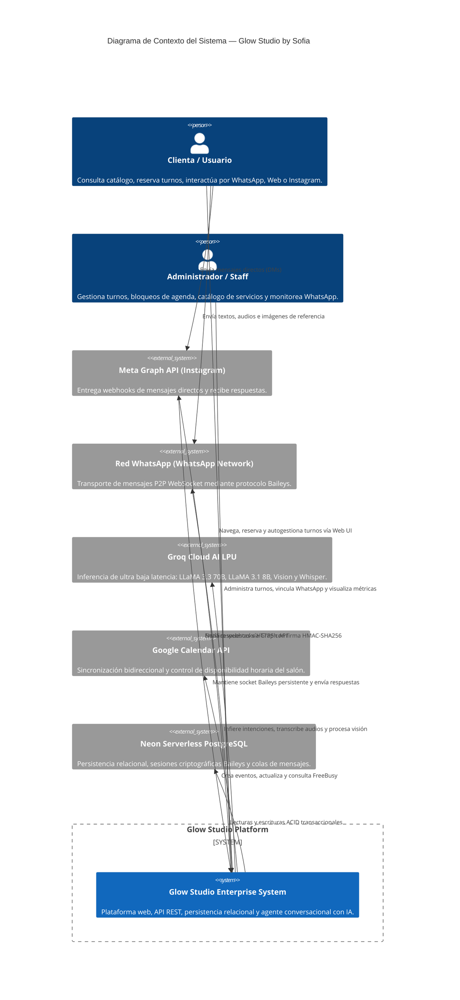

---

### Nivel 2: Contenedores (Container Diagram)

El sistema se compone de tres micro-servicios autónomos orquestados en la nube y respaldados por Neon PostgreSQL.

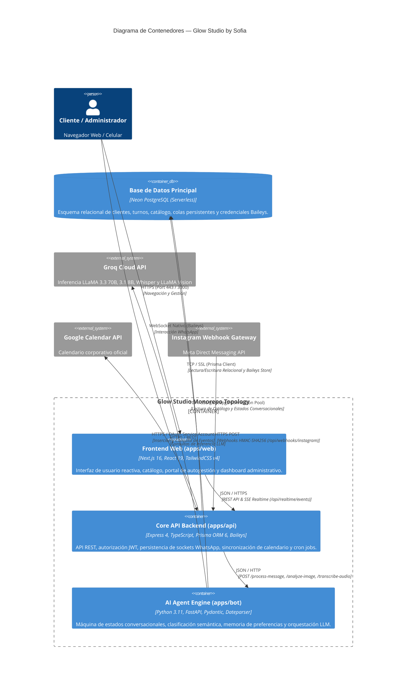

---

### Nivel 3: Componentes de Express API

Desglose interno de los módulos, servicios y middlewares de `apps/api`.

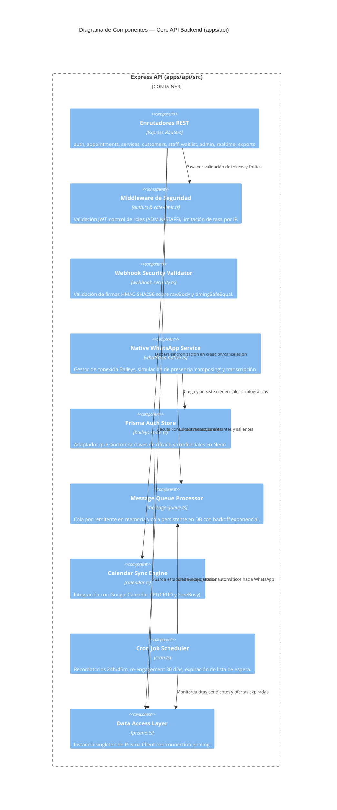

---

### Nivel 3: Componentes del Bot IA (FastAPI)

Estructura interna del motor conversacional inteligente en `apps/bot`.

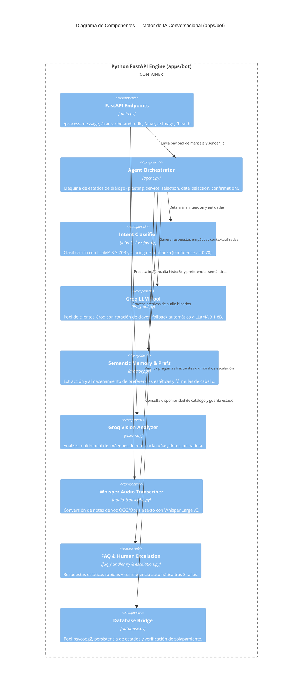

---

### Nivel 3: Componentes del Frontend (Next.js 16)

Arquitectura de presentación moderna en `apps/web`.

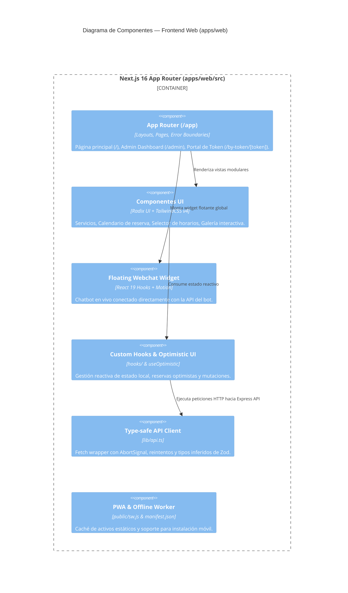

---

## 3. Flujos de Datos Principales

### 3.1 Flujo de Reserva Multicanal

Diagrama de secuencia de una reserva iniciada desde la Web o WhatsApp, mostrando la sincronización en base de datos y Google Calendar:

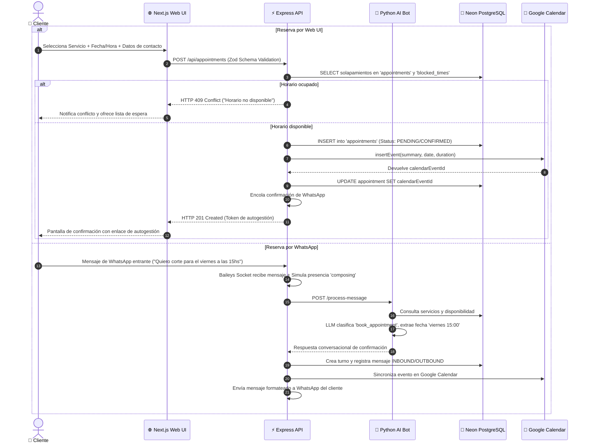

---

### 3.2 Pipeline Conversacional del Bot IA (Groq Cloud)

El procesamiento conversacional ejecuta un pipeline multi-etapa con análisis semántico, memoria de usuario y tolerancia a fallos:

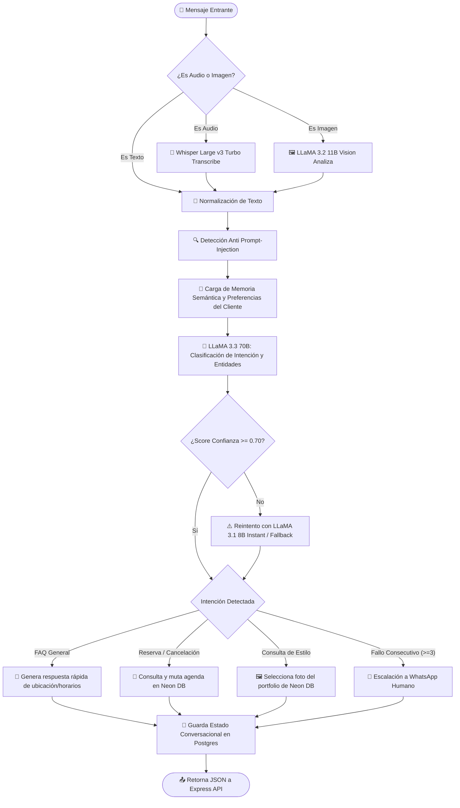

---

### 3.3 Persistencia de Sockets Baileys en PostgreSQL

Para operar de forma completamente nativa sin depender de servicios externos de pago y resistir reinicios en servidores efímeros (como Render Free Tier), las credenciales de WhatsApp se persisten en Neon PostgreSQL:

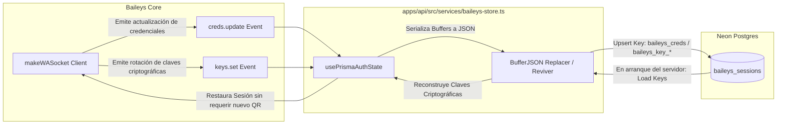

#### Propiedades del Adaptador:
- **Clave Maestra:** `baileys_creds` almacena el par de claves Noise, identidad y estado de registro.
- **Claves Específicas:** `baileys_key_<type>_<id>` almacena pre-claves, claves de sesión de remitentes y cadenas de cifrado.
- **Reviver / Replacer Criptográfico:** Convierte arrays de bytes `Buffer` de Node.js a representaciones JSON serializables con preservación exacta de longitud.

---

### 3.4 Sincronización Bidireccional con Google Calendar

El módulo `calendar.ts` interactúa con Google Calendar mediante autenticación OAuth de Cuenta de Servicio (`GoogleAuth`):

```mermaid
flowchart TD
    subgraph Creación de Turno
        A[POST /api/appointments] --> B[Valida conflicto en DB]
        B --> C[Inserta Turno en Neon DB]
        C --> D[Llama calendar.events.insert]
        D --> E{¿Respuesta Exitosa?}
        E -- Sí --> F[Guarda calendarEventId en Appointment]
        E -- No --> G[Loguea advertencia: DB preserva la cita]
    end

    subgraph Consulta de Disponibilidad
        H[GET /api/appointments/availability] --> I[Consulta FreeBusy en Google Calendar]
        I --> J[Consulta Turnos y Bloqueos en Neon DB]
        J --> K[Calcula intersección de slots libres de 30/45/60 min]
        K --> L[Retorna slots disponibles a Web y Bot]
    end

    subgraph Cancelación o Reagendamiento
        M[POST /api/appointments/:id/cancel] --> N[Actualiza estado a CANCELLED]
        N --> O[Llama calendar.events.delete usando calendarEventId]
        O --> P[Evento eliminado de Google Calendar]
    end
```

---

### 3.5 Cola de Mensajería Saliente y Resiliencia Anti-Ban

Para garantizar el cumplimiento de las políticas de uso y prevenir bloqueos de cuenta de WhatsApp, la API implementa una arquitectura de doble cola:

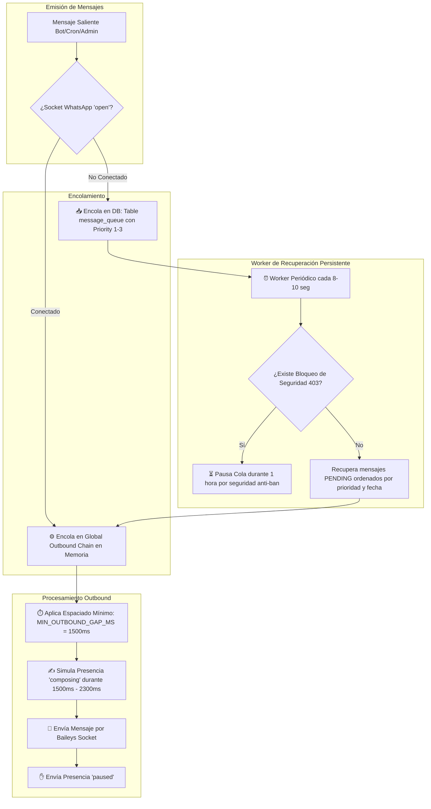

---

## 4. Capas de Seguridad y Blindaje de Red

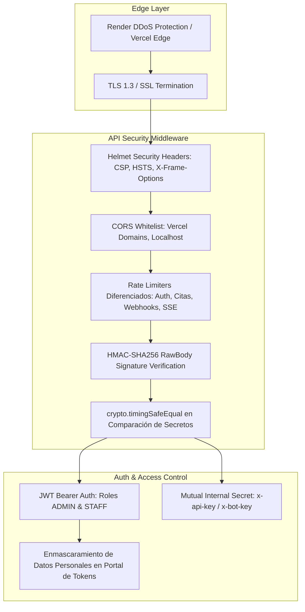

---

## 5. Topología de Despliegue e Infraestructura

| Componente | Servicio en Render / Plataforma | Runtime / Versión | Propósito | Cuenta de Render |
|---|---|---|---|---|
| **Frontend Web** | `glow-studio-web` (o Vercel) | Node.js 20+ (Next.js 16) | Interfaz pública y panel administrativo | `eneidaantonia3010@gmail.com` |
| **Core API Backend** | `glow-studio-api` | Node.js 22 (Express 4) | API REST, Baileys WhatsApp, Cron Jobs | `restrepojivana7@gmail.com` |
| **AI Bot Engine** | `glow-studio-bot` | Python 3.11.9 (FastAPI) | Agente conversacional e inferencia Groq | `superfruitas301083@gmail.com` |
| **Base de Datos** | Neon Serverless Postgres | PostgreSQL 16 | Almacenamiento relacional ACID | Neon Cloud |
| **Monitoreo Keep-Alive** | UptimeRobot | HTTP / Ping | Previene suspensión por inactividad | Externo |

---

*Fin del documento de arquitectura.*
