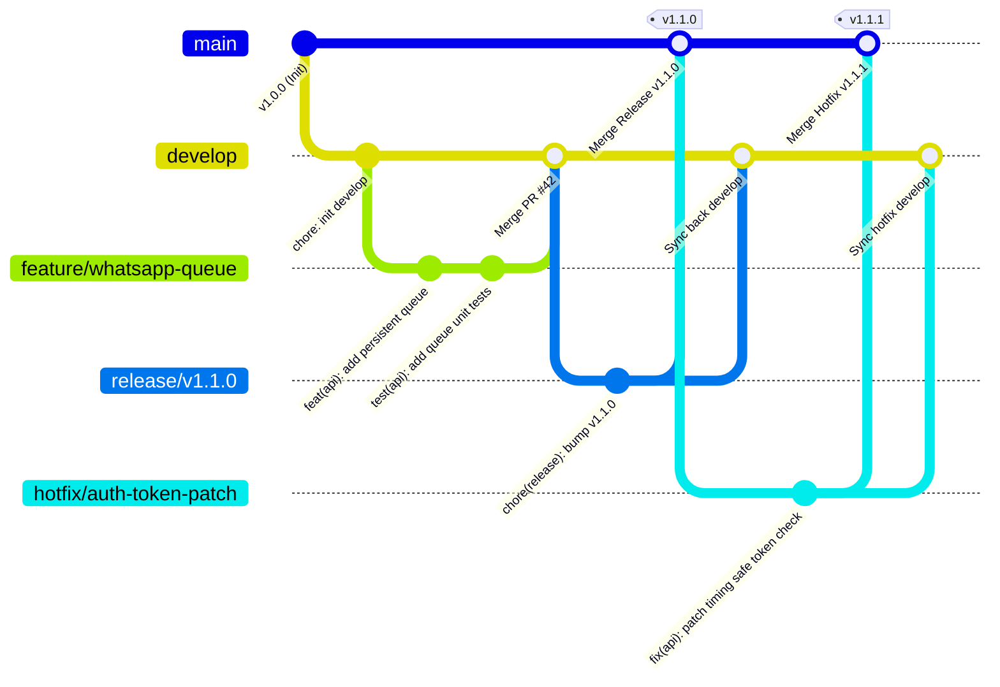
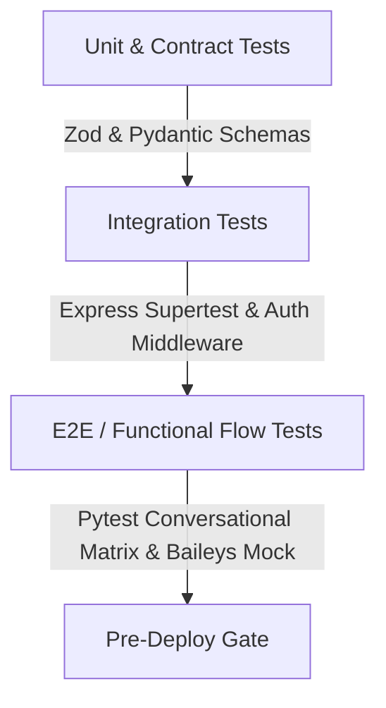

# 🤝 Guía de Contribución y Estándares de Ingeniería

> **Proyecto:** Glow Studio by Sofia  
> **Versión de Guía:** 2.0.0  
> **Aplica a:** Todos los ingenieros, colaboradores y mantenedores del repositorio.

¡Gracias por contribuir a **Glow Studio by Sofia**! Para mantener un código robusto, seguro y mantenible en nuestro monorepo omnicanal, todos los colaboradores deben seguir rigurosamente los estándares técnicos, flujos de ramas y políticas de calidad detalladas a continuación.

---

## 📑 Tabla de Contenidos
1. [Flujo de Ramas (GitFlow Estricto)](#1-flujo-de-ramas-gitflow-estricto)
2. [Convención de Commits (Conventional Commits)](#2-convención-de-commits-conventional-commits)
3. [Configuración del Entorno de Desarrollo Local](#3-configuración-del-entorno-de-desarrollo-local)
4. [Estrategia y Comandos de Test](#4-estrategia-y-comandos-de-test)
5. [Ciclo de Vida de Pull Requests y Reglas de Validación](#5-ciclo-de-vida-de-pull-requests-y-reglas-de-validación)
6. [Estándares de Código y Buenas Prácticas](#6-estándares-de-código-y-buenas-prácticas)

---

## 1. Flujo de Ramas (GitFlow Estricto)

Utilizamos una adaptación estricta del modelo **GitFlow** diseñada para soportar despliegues continuos multicanal sin interrupción del servicio de WhatsApp ni desincronización de esquemas en Neon.



### 1.1 Definición de Ramas

| Tipo de Rama | Origen (Branch From) | Destino (Merge To) | Convención de Nombre | Propósito |
|---|---|---|---|---|
| **`main`** | *N/A (Rama Principal)* | *N/A* | `main` | Código en producción activa. **Protegida contra push directo.** Requiere CI verde y 1 aprobación de Tech Lead. |
| **`develop`** | `main` | `main` | `develop` | Rama de integración de nuevas funcionalidades. Base para el trabajo diario. |
| **`feature/*`** | `develop` | `develop` | `feature/nombre-descriptivo` (ej: `feature/baileys-reconnect-jitter`) | Desarrollo de nuevas capacidades, endpoints o mejoras UI. |
| **`bugfix/*`** | `develop` | `develop` | `bugfix/nombre-descriptivo` (ej: `bugfix/calendar-timezone-offset`) | Corrección de defectos detectados durante el ciclo de desarrollo en `develop`. |
| **`hotfix/*`** | `main` | `main` y `develop` | `hotfix/nombre-incidente` (ej: `hotfix/meta-signature-rawbody`) | Parches urgentes para producción (S1/S2). Genera un tag de versión patch. |
| **`release/*`** | `develop` | `main` y `develop` | `release/vX.Y.Z` | Preparación final de versión previa a producción. |

### 1.2 Reglas de Operación Git
1. **Nunca hacer push directo a `main` ni a `develop`.**
2. **Rebase sobre `develop`:** Antes de solicitar revisión de un PR, ejecuta `git fetch origin && git rebase origin/develop` para resolver conflictos en tu rama local.
3. **Squash and Merge:** Todo PR se fusiona mediante *Squash and Merge* para mantener un historial lineal y legible en `develop` y `main`.

---

## 2. Convención de Commits (Conventional Commits)

Seguimos la especificación formal de [Conventional Commits v1.0.0](https://www.conventionalcommits.org/). Todos los mensajes deben estar redactados en idioma inglés o español consistente y seguir la estructura:

```text
<tipo>(<ámbito opcional>): <descripción concisa en imperativo>

[cuerpo explicativo opcional: contexto del problema y por qué se tomó la solución]

[pie de página opcional: referencias a tickets o BREAKING CHANGE]
```

### 2.1 Tipos Permitidos

- **`feat`**: Una nueva funcionalidad para el usuario o sistema (ej. nuevo endpoint, componente UI).
- **`fix`**: Corrección de un bug o fallo en producción o pruebas.
- **`docs`**: Cambios exclusivos en documentación (`README.md`, `API.md`, comentarios JSDoc/Docstrings).
- **`style`**: Formateo de código, punto y coma faltante, indentación (sin impacto en lógica).
- **`refactor`**: Refactorización de código sin añadir funcionalidades ni corregir bugs.
- **`perf`**: Cambio de código orientado a mejorar el rendimiento o latencia.
- **`test`**: Creación o modificación de suites de pruebas unitarias o de integración.
- **`build`**: Modificaciones en el sistema de compilación, dependencias o configuración del monorepo (`package.json`, `pnpm-workspace.yaml`, `tsconfig.json`).
- **`ci`**: Cambios en workflows de CI/CD (GitHub Actions, Render Blueprints).
- **`chore`**: Tareas rutinarias de mantenimiento, actualización de `.gitignore`, scripts auxiliares.

### 2.2 Ámbitos (Scopes) Recomendados

- `(web)`: Frontend Next.js 16 (`apps/web`)
- `(api)`: Express API Backend (`apps/api`)
- `(bot)`: Agente IA Python (`apps/bot`)
- `(db)`: Esquema Prisma, migraciones o seeds (`prisma/`)
- `(baileys)`: Módulo de WhatsApp nativo y sesiones
- `(calendar)`: Google Calendar Sync
- `(auth)`: JWT, API Keys y permisos

### 2.3 Ejemplos Válidos e Inválidos

#### ✅ Válidos:
```text
feat(api): implement persistent message queue in PostgreSQL with exponential backoff
fix(baileys): resolve memory leak on socket reconnects with gaussian jitter
perf(bot): reduce Groq inference latency using llama-3.1-8b-instant fallback pool
docs(api): document rawBody HMAC verification on Meta webhooks
fix(web)!: break legacy appointment payload structure to enforce Zod v4 validation

BREAKING CHANGE: The /api/appointments payload now strictly requires ISO-8601 strings for `date`.
```

#### ❌ Inválidos:
```text
arreglado el bot
cambios varios
feat: fix stuff
Update appointments.ts
WIP
```

---

## 3. Configuración del Entorno de Desarrollo Local

### 3.1 Prerrequisitos de Software
- **Node.js:** Versión 20.x o 22.x LTS (`node -v`)
- **Python:** Versión 3.11.x (`python --version`)
- **Gestor de Paquetes:** `npm` o `pnpm` (`pnpm --version`)
- **Git:** Versión 2.35+
- **PostgreSQL / Neon Account:** URL de conexión SSL activa (`DATABASE_URL`)

### 3.2 Pasos de Inicialización

#### 1. Clonar el Repositorio
```bash
git clone https://github.com/eneidaantonia3010-web/bot-whatsapp.git
cd bot-whatsapp
```

#### 2. Configuración de Variables de Entorno
Copia la plantilla de variables y completa las credenciales requeridas:
```bash
cp .env.example .env
```
> [!IMPORTANT]
> En entorno local, `JWT_SECRET` puede utilizar el valor por defecto de desarrollo, pero `DATABASE_URL` debe apuntar a tu base de datos de desarrollo (local o Neon branch).

#### 3. Instalación de Dependencias del Monorepo
Instala las dependencias en la raíz, los paquetes de Node y el entorno Python:
```bash
# 1. Instalar dependencias raíz y generar cliente Prisma
npm install

# 2. Instalar dependencias del Frontend Web
npm run install:web

# 3. Instalar dependencias del Backend Express API
npm run install:api

# 4. Instalar dependencias de Python para el Bot IA
npm run install:bot
```

#### 4. Sincronización y Carga de Datos en Base de Datos
```bash
# Sincronizar el esquema Prisma con la base de datos
npm run db:push

# Ejecutar el seed con catálogo oficial y datos de prueba
npm run db:seed
```

#### 5. Ejecución en Modo Desarrollo
Puedes iniciar todos los servicios concurrentemente o de forma individual:

```bash
# Iniciar todos los servicios en simultáneo (Web en :3000, API en :3001, Bot en :8000)
npm run dev:all
```

O en terminales separadas:
```bash
# Terminal 1 — Frontend Web
npm run dev:web

# Terminal 2 — Express API (con hot-reload tsx)
npm run dev:api

# Terminal 3 — Python Bot (FastAPI + Uvicorn)
npm run dev:bot
```

---

## 4. Estrategia y Comandos de Test

El proyecto cuenta con una pirámide de pruebas automatizadas que cubre contratos de esquema, middleware de autenticación, concurrencia de reservas y flujos conversacionales de IA.



### 4.1 Comandos de Ejecución de Pruebas

| Comando | Alcance | Motor de Ejecución |
|---|---|---|
| `npm run test:all` | Ejecuta la suite de pruebas completa de los 3 servicios | Vitest + Pytest |
| `npm run test:api` | Pruebas de endpoints REST, Zod, middleware y concurrencia | Vitest (`apps/api/tests/`) |
| `npm run test:web` | Pruebas de componentes React y contratos de frontend | Vitest (`apps/web/`) |
| `npm run test:bot` | Pruebas de clasificación de intenciones y diálogo de IA | Pytest (`apps/bot/tests/`) |
| `npm run type-check:all` | Verificación estricta de tipos TypeScript sin emitir JS | `tsc --noEmit` |
| `npm run validate:all` | **Comando Maestro de Calidad:** type-check + tests + build | Monorepo CI Check |

### 4.2 Verificación Previa al Commit
Antes de abrir un Pull Request, ejecuta obligatoriamente:
```bash
npm run validate:all
```

---

## 5. Ciclo de Vida de Pull Requests y Reglas de Validación

### 5.1 Creación del Pull Request (PR)
1. **Título Estructurado:** El título del PR debe seguir la convención de commit (ej: `feat(api): add waitlist auto-offer cron worker`).
2. **Plantilla de Descripción Obligatoria:**
   - **Descripción del Cambio:** ¿Qué problema resuelve o qué capacidad añade?
   - **Módulos Afectados:** Lista de apps (`apps/api`, `apps/web`, `apps/bot`, `prisma`).
   - **Pruebas Realizadas:** Comandos ejecutados y resultados obtenidos.
   - **Capturas / Logs:** Si aplica para cambios de UI o logs de API.

### 5.2 Criterios de Aprobación (Merge Gates)
- [ ] **Type-Check Limpio:** 0 errores en `npm run type-check:all`.
- [ ] **Tests Aprobados:** 100% de tests pasando en `npm run test:all`.
- [ ] **Build Exitoso:** `npm run build:all` genera los bundles sin advertencias críticas.
- [ ] **Seguridad Verificada:** No se incluyen credenciales en crudo, API keys ni endpoints desprotegidos.
- [ ] **Actualización de Documentación:** Si se alteran endpoints, actualizar `API.md`. Si se toman decisiones de diseño, registrar ADR en `DECISIONS.md`.

---

## 6. Estándares de Código y Buenas Prácticas

### 6.1 TypeScript & Node.js (`apps/api`, `apps/web`)
- **No `any` arbitrario:** Tipar todas las funciones, parámetros y retornos. Si la estructura es dinámica, usar `unknown` junto con Zod para validar antes del acceso.
- **Validación en la Frontera:** Toda entrada HTTP (Body, Query, Params) debe parsearse inmediatamente con un esquema Zod.
- **Manejo Seguro de Asincronía:** Toda promesa debe envolverse en `try/catch` o conectarse a un gestor de errores centralizado.

### 6.2 Python & FastAPI (`apps/bot`)
- **Tipado Estricto con Pydantic:** Todos los modelos de entrada y salida deben extender de `BaseModel`.
- **Delimitadores Anti-Injection:** Enviar prompts a Groq encapsulados entre delimitadores unívocos (e.g. `### TEXTO CLIENTE ###`) para evitar que el usuario suplante instrucciones del sistema.
- **Manejo de Timeouts en LLM:** Cualquier llamada externa a Groq o la API debe tener un timeout explícito (`httpx.Timeout(45.0)`).

### 6.3 Base de Datos y Transaccionalidad (`prisma/`)
- **Consultas con Bloqueo / Control de Concurrencia:** En reservas de turnos, verificar solapamiento horario de forma atómica antes de insertar registros.
- **Evitar N+1 Queries:** Utilizar cláusulas `include` de Prisma de forma consciente para minimizar viajes de red hacia Neon.

---

*¡Gracias por mantener el código de Glow Studio con los más altos estándares de ingeniería!*
